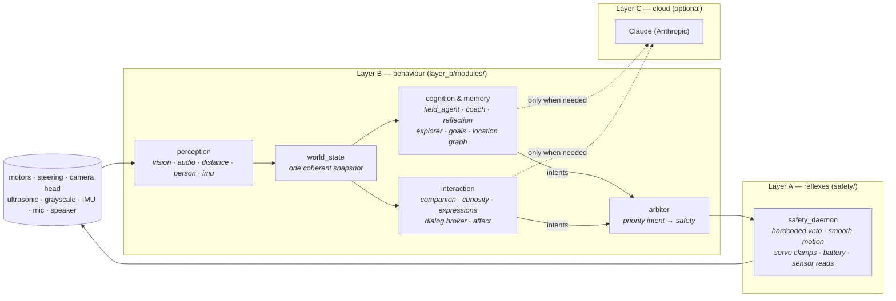

# PiCar-X — an autonomous, curious robot

A behaviour stack for the [SunFounder PiCar-X](https://www.sunfounder.com/products/picar-x)
(a Raspberry Pi rover with a pan/tilt camera, ultrasonic + grayscale sensors,
Ackermann steering and a Robot HAT). It turns the kit into a small autonomous
creature that explores on its own, learns the layout of a room, recognises
people and objects, converses, reflects on what it has done, and — when nothing
is going on — glances around and mutters to itself.

The design goal is **emergent, resource-light autonomy that fails soft**: many
tiny single-purpose processes gossip over a message bus, no single module is
load-bearing, and the one thing that must never break — physical safety — is a
separate hardcoded layer that can veto everything above it.

---

## The big idea

Three tiers, loosely coupled through an MQTT bus. Nothing calls anything else
directly; modules publish facts and intents, and subscribe to what they care
about.



- **Layer A — reflexes (`safety/safety_daemon.py`).** The sole owner of *all*
  hardware — drive motors, steering, and every sensor on the HAT. It ramps
  motion smoothly, clamps the camera servos to their physical range, watches the
  battery, and **vetoes** any commanded action it deems unsafe (obstacle too
  close, cliff detected, sustained blind reverse). It also *serves* raw sensor
  reads (ultrasonic distance, the I2C IMU) back over its socket, so no Layer B
  module ever touches `robot_hat` directly. It speaks a Unix socket, not the
  bus, and its veto authority is never delegated upward. Everything above it is
  advisory.

- **Layer B — behaviour (`layer_b/modules/`).** ~27 small Python processes,
  each an independent MQTT participant: perception, world modelling, autonomous
  driving, memory, dialogue, tools, and a web console. This is where almost all
  the code lives.

- **Layer C — the cloud LLM (optional).** [Claude](https://www.anthropic.com/)
  powers conversation, high-level coaching, and idle reflection — but only as a
  *last resort* on cold or ambiguous situations. Pull the API key and the robot
  keeps exploring, remembering and reacting; it just gets quieter and less
  articulate.

### The bus, and why everything is fail-soft

All Layer B modules talk over a local **MQTT broker** (mosquitto,
`localhost:1883`) via a thin wrapper, [`broker_client.Bus`](layer_b/broker_client.py).
Two consequences shape the whole codebase:

- **Additive capabilities.** A new behaviour is a new file in
  `layer_b/modules/` plus one line in
  [`module_registry.json`](layer_b/module_registry.json). It subscribes to the
  topics it needs and publishes its own. No core process changes.
- **Crash isolation.** Every bus callback is guarded, every hardware/sensor
  read is `try`/soft-`None`, and a module that dies or is disabled degrades the
  robot to *exactly* its previous behaviour — never to an unsafe or stuck one.
  Intents carry a TTL, so a hung module can't leave the robot driving.

### How motion actually reaches the wheels

Modules never touch the safety socket. They publish an **intent**:

```jsonc
// picarx/intent/move
{ "source": "field_agent", "priority": 10,
  "action": { "direction": "forward", "speed": 25 }, "ttl": 1.0 }
```

The [`arbiter`](layer_b/modules/arbiter.py) collects intents from every source,
picks the highest-priority live one, and is the *only* module that opens the
safety socket. The safety daemon then executes or vetoes it and reports the
result back on the bus. Camera head moves (`picarx/intent/look`) ride a
separate channel so a glance never competes with driving.

---

## What it can do

| Area | Modules | What happens |
|---|---|---|
| **Perception** | `vision_basic`, `person_memory`, `distance_sensor`, `imu`, `audio_nodes` | Motion-gated SSD object detection + tracking and Haar faces from the camera; on-board visual memory relabels uncertain sightings; recognises known people; ultrasonic range; a head-mounted MPU-6050 IMU for body motion / bumps / pickups (read *through* the safety daemon, frame-independent, fail-soft when absent); mic → speech-to-text (Vosk) and text-to-speech (eSpeak), with a band-pass noise filter and a mic kill-switch. |
| **World model** | `world_state`, `event_logger` | One timestamped, staleness-flagged snapshot of everything the robot knows (`picarx/state/world`); an append-only telemetry log in SQLite. |
| **Autonomy & motion** | `field_agent`, `arbiter`, `steering_controller` | Curiosity-driven wandering, smooth pure-pursuit obstacle avoidance (now flowing around dead-center and featureless obstacles before reversing), active hypothesis probes, look-around room scans, and passive learning from human demonstrations. |
| **Memory & reflection** | `reflection`, `location_graph`, `explorer`, `goal_manager`, `pattern_miner` | A topological map of places from head-sweep fingerprints; per-place uncertainty that steers exploration; long-horizon advisory goals; idle-time reflection and pure-Python temporal pattern mining that distil experience into durable facts. |
| **Attention & dialogue** | `dialog`, `attention` | One central turn-taking broker answers "is this utterance addressed to me, and is it the answer to my open question?" so a command, a web-console button, or one module's answer can't be swallowed by another. `attention.py` is the shared, pure model (wake-word / conversation-window / command-shape classification). |
| **Interaction & personality** | `companion`, `curiosity`, `expressions` | Spoken conversation via Claude, now grounded in the robot's *own* recent experience so it speaks in the first person ("someone just picked me up", "I got stuck in the corner earlier"); questions about genuinely ambiguous sightings ("is that a chair or a speaker?"); and ambient personality — idle musings, curious head-tilts, greetings, notes-to-self, and an **affect layer** (decaying curiosity / frustration / satisfaction moods made legible as head gestures). |
| **Observability** | `debug_monitor`, `heartbeat`, `behavior_metrics` | A unified per-module liveness heartbeat on one bus topic; an always-on `/proc`-based per-process CPU/telemetry log; and real-world collision/veto-rate instrumentation that (with the A/B experiment scaffolding) proves whether the self-training loop actually helps. |
| **Practical tools** | `tools_registry`, `radio`, `reminder_daemon`, `follow_daemon`, `bluetooth_daemon`, `health_daemon`, `web_console` | A voice→topic command router, internet radio, reminders, person-following, Bluetooth, homeostatic low-power self-preservation, and a multi-page phone/laptop web console (dashboard, live camera + RC driving, object-training, people & places, audio/radio, and a browser-editable config page). |

Two of these deserve a note because they define the robot's character:

- **`curiosity`** turns the vision detector's *uncertainty* into cheap, human-
  labelled ground truth: when it isn't sure what it sees, it asks, and the one-
  word answer is written straight to memory. It no longer races for "the next
  utterance" — it registers its question with the `dialog` broker, which routes
  back only a genuine answer (and tells it to fall back to the LLM if the
  question expires unanswered).
- **`expressions`** supplies the "alive when idle" connective tissue. It
  dispatches a handful of gentle tools — **speak**, **look around**, **tilt the
  head with curiosity**, an **emote gesture** (a mood made legible as a head
  cock / nod / shake), and **remember something important** — both *randomly*
  (occasional musings and glances in quiet moments), in *reaction to context*
  (greet a returning person, cock its head at a confidently-new object), and
  from its own *internal state* (the affect layer's decaying moods). It never
  drives, defers completely while the robot is busy or being spoken to, and
  shares the one speaker and one camera head under strict cooldowns. Its notes
  flow to `picarx/memory/note`, which `reflection` — the sole writer to the
  memory database — persists.

For the full history of how these capabilities were built, see
[`ROADMAP_STATUS.md`](ROADMAP_STATUS.md).

---

## Data & memory

Three SQLite databases under `layer_b/data/` (git-ignored), each with a **single
writer** by convention so concurrent processes never race on a file:

| Database | Owner / sole writer | Holds |
|---|---|---|
| `events.db` | `event_logger` | Append-only telemetry of everything on the bus. |
| `semantic.db` | `reflection` | Durable facts, mined patterns, the robot's self-model. |
| `spatial.db` | `location_graph` | The topological place graph. |

Facts are short natural-language statements with a decaying confidence and a
source. They come from idle LLM reflection, pure-Python pattern mining, direct
human corrections, and now `expressions`' notes-to-self — and they flow *back*
into future coach and companion prompts, so the robot's behaviour is shaped by
its own accumulated experience.

### Importing pre-trained knowledge

The robot's decision modules can also practise in a virtual world first — see
the sibling [**picarx-training**](../picarx-training) simulator, which runs
`field_agent`/`coach`/… unmodified against synthetic sensors and distils each
session into a portable **knowledge pack**:

| File in the pack | Combined into | Carries |
|---|---|---|
| `coach_policy.json` | `data/coach_policy.json` | Learned escape maneuvers (bandit arms). |
| `navigation_facts.json` | `semantic.db` | Transferable facts + mined behaviour patterns. |
| `knowledge_pack.json` | — | Manifest: scenarios trained, episode counts, provenance, lineage. |

[`import_training.py`](layer_b/import_training.py) folds a pack into
`layer_b/data/`, so the robot starts real-world operation already knowing how
to get unstuck instead of learning every escape on the carpet:

```bash
# on the robot, with Layer B stopped (this tool writes files the modules own):
python3 layer_b/import_training.py /path/to/training_data --dry-run   # preview
python3 layer_b/import_training.py /path/to/training_data             # apply (merge)
python3 layer_b/import_training.py /path/to/training_data --adopt     # apply (adopt)
```

It **combines** rather than overwrites, and never clobbers real-world learning:
unseen situations, arms, and facts are always adopted, and the robot's own
embedding is kept (the pack's fills a gap only). For an arm the robot **already
knows**, how the two records combine depends on where the pack came from:

| Mode | Shared arm becomes | Use when |
|---|---|---|
| **merge** (default) | robot's counts **+** pack's counts | The robot and the trainer learned **independently** — a pack built on a dev machine, or a cold-started sim. Two separate bodies of evidence genuinely add up. |
| **adopt** (`--adopt`) | the pack's refined counts **replace** the robot's | The pack was seeded from **this robot's own** `coach_policy.json` and refined in sim (a self-training round-trip). Summing would double-count the shared seed. |

The double-counting adopt avoids is concrete: an arm the robot exports at 7 wins
/ 1 loss and the sim refines to 10/2 would import **back** as 17/3 under merge,
inflating an arm the robot has really only seen ten times. `--adopt` imports it
as 10/2.

To make picking the mode easy, the trainer stamps each pack's manifest with a
**lineage** id — a hash of the seed policy it was trained from (or `cold` if it
started from scratch). The importer prints it, and if it matches this robot's
own policy it flags the pack as a self-training round-trip and suggests
`--adopt`. `--dry-run` shows the active mode and exactly what would change,
writing nothing.

Only robot-dynamics knowledge is ever imported — the sim's rooms are not this
house, so place-specific memories and the spatial map stay out of the pack, and
the robot rebuilds those from real sensors. Restart the orchestrator afterwards
so the modules reload the combined files.

### Closing the loop — and proving it helps

`self_trainer` (disabled by default) closes that round-trip on the robot itself:
while genuinely idle it snapshots its own learning stores, refines them in the
sibling simulator as a `nice`-d subprocess, and folds the result back in *through
the same online intakes the owning modules expose* — never becoming a second
writer of `coach_policy.json` or `semantic.db`. Any real activity instantly
SIGTERMs the session; a missing sibling repo just means "no self-training this
window."

Because a self-improvement loop is a *hypothesis* until it's measured, the loop
is instrumented rather than trusted. `experiment.py` assigns each session an A/B
condition (even → **adopt**: sim-trained coach arms in play; odd → **control**:
those arms held out, so the session runs the pre-adoption baseline);
`behavior_metrics.py` records the real-world veto/impact/fail-loop rates tagged
with that condition; and `ab_report.py` compares adopt vs control offline,
refusing to over-claim below a minimum number of sessions per condition. Set
`experiment.enabled=false` once the round-trip has earned its keep.

---

## Running it

On the robot (a Raspberry Pi with the PiCar-X assembled), three things run:

1. **mosquitto** — the MQTT broker (`localhost:1883`).
2. **`safety/safety_daemon.py`** — Layer A. Start it first; it owns the hardware.
3. **`layer_b/orchestrator.py`** — the Layer B supervisor. It reads
   `module_registry.json`, starts one `python3` subprocess per enabled module,
   and watches the manifest and module files: add/enable/edit an entry and it
   hot-starts or restarts just that module, no full reboot.

```bash
# Layer A (owns the wheels)
python3 safety/safety_daemon.py

# Layer B (everything else)
python3 layer_b/orchestrator.py
```

Enable or disable any behaviour by flipping `"enabled"` in
[`module_registry.json`](layer_b/module_registry.json).

### Configuration

Every tunable lives in [`layer_b/config.json`](layer_b/config.json) at its
default, read through [`robot_config`](layer_b/robot_config.py). Precedence per
knob is **environment variable > `config.json` > built-in default**, and the
file is fail-soft — delete or corrupt it and the robot runs on built-ins. The
one secret, `ANTHROPIC_API_KEY`, is *only* ever an environment variable, never
in the file. Without it, the LLM-backed modules quietly stand down.

### Hardware

Raspberry Pi + SunFounder PiCar-X: Robot HAT, 2× 18650 Li-ion (≈8.4 V full),
DC drive motors, an Ackermann steering servo, a pan/tilt camera head, an
ultrasonic range finder, and grayscale line/cliff sensors. An optional
head-mounted MPU-6050 IMU adds body-motion / bump / pickup sensing; the whole
stack runs without it (it degrades to vision + ultrasonic). Vision uses
`picamera2` + OpenCV; speech uses Vosk (STT) and eSpeak/MBROLA (TTS). Internet
radio needs `mpv` (optional).

> The code resolves its own paths relative to the `layer_b/` directory it lives
> in, so the tree can be checked out or deployed anywhere — no fixed install
> location. Set `LAYER_B_HOME` to override the root (e.g. a symlinked install, or
> code and data deliberately split apart).

---

## Development & tests

The Layer B code targets the Pi, but its logic is exercised **off-robot** with a
test harness that stubs the hardware/C-extension imports (`picamera2`, `cv2`,
`vosk`, `paho`, …) and swaps the MQTT `Bus` for an in-memory fake. Modules are
written with their decision logic in **pure, hardware-free helper functions**,
so the interesting behaviour is unit-testable without a robot.

```bash
python3 -m unittest discover -s tests
```

The suite is ~500 fast, deterministic tests (`tests/`, sharing
[`tests/harness.py`](tests/harness.py)) covering perception logic, the safety
motion smoother, the memory stores, exploration, the personality modules, and
more. Off-robot steering behaviour can also be inspected with
`python3 tools/simulate_steer.py`.

---

## Repository layout

```
safety/                 Layer A — the hardcoded safety daemon (owns the wheels)
layer_b/
  orchestrator.py       Layer B supervisor: subprocess per module, hot reload
  module_registry.json  Which modules run (name → entrypoint → enabled)
  broker_client.py      The MQTT Bus wrapper every module uses (+ heartbeat)
  config.json           All tunables, at their defaults
  robot_config.py       env > config.json > default resolution
  attention.py          pure turn-taking model (addressed? answer to my question?)
  heartbeat.py          the unified per-module liveness beacon
  experiment.py         A/B condition rotation (adopt vs control)
  ab_report.py          offline adopt-vs-control learning-loop report
  semantic_store.py     facts / patterns / self-model  (semantic.db)
  spatial_store.py      the topological place graph      (spatial.db)
  import_training.py    combine a picarx-training knowledge pack into data/ (merge|adopt)
  embedding_util.py     on-board text embeddings (MiniLM/ONNX)
  modules/              the ~27 Layer B behaviours
    tools/              utility daemons (health, reminders, follow, bluetooth)
    vision_basic.py  audio_nodes.py  imu.py  world_state.py  arbiter.py
    field_agent.py   coach.py  reflection.py  companion.py  dialog.py
    curiosity.py     expressions.py  behavior_metrics.py  debug_monitor.py
    location_graph.py  explorer.py …
  web_ui/               the web console front-end (dashboard / drive / people /
                        training / audio / config pages)
tests/                  off-robot unittest suite + shared harness
tools/                  developer tools (e.g. steering simulator)
ROADMAP_STATUS.md       detailed build log of every capability
```
