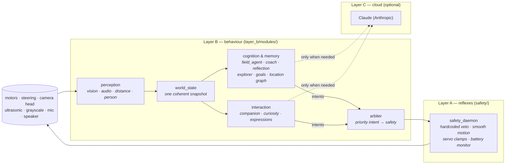

# PiCar-X — an autonomous, curious robot

A behaviour stack for the [SunFounder PiCar-X](https://www.sunfounder.com/products/picar-x)
(a Raspberry Pi rover with a pan/tilt camera, ultrasonic + grayscale sensors,
Ackermann steering and a Robot HAT). It turns the kit into a small autonomous
creature that explores on its own, learns the layout of a room, recognises
people and objects, converses, reflects on what it has done, and — when nothing
is going on — glances around and mutters to itself.

The design goal is **emergent, resource-light autonomy that fails soft**: many
tiny single-purpose processes gossip over a message bus, no single module is
load-bearing, and the one thing that must never break — physical safety — is a
separate hardcoded layer that can veto everything above it.

---

## The big idea

Three tiers, loosely coupled through an MQTT bus. Nothing calls anything else
directly; modules publish facts and intents, and subscribe to what they care
about.



- **Layer A — reflexes (`safety/safety_daemon.py`).** The sole owner of the
  drive motors and steering. It ramps motion smoothly, clamps the camera
  servos to their physical range, watches the battery, and **vetoes** any
  commanded action it deems unsafe (obstacle too close, cliff detected,
  sustained blind reverse). It speaks a Unix socket, not the bus, and its veto
  authority is never delegated upward. Everything above it is advisory.

- **Layer B — behaviour (`layer_b/modules/`).** ~25 small Python processes,
  each an independent MQTT participant: perception, world modelling, autonomous
  driving, memory, dialogue, tools, and a web console. This is where almost all
  the code lives.

- **Layer C — the cloud LLM (optional).** [Claude](https://www.anthropic.com/)
  powers conversation, high-level coaching, and idle reflection — but only as a
  *last resort* on cold or ambiguous situations. Pull the API key and the robot
  keeps exploring, remembering and reacting; it just gets quieter and less
  articulate.

### The bus, and why everything is fail-soft

All Layer B modules talk over a local **MQTT broker** (mosquitto,
`localhost:1883`) via a thin wrapper, [`broker_client.Bus`](layer_b/broker_client.py).
Two consequences shape the whole codebase:

- **Additive capabilities.** A new behaviour is a new file in
  `layer_b/modules/` plus one line in
  [`module_registry.json`](layer_b/module_registry.json). It subscribes to the
  topics it needs and publishes its own. No core process changes.
- **Crash isolation.** Every bus callback is guarded, every hardware/sensor
  read is `try`/soft-`None`, and a module that dies or is disabled degrades the
  robot to *exactly* its previous behaviour — never to an unsafe or stuck one.
  Intents carry a TTL, so a hung module can't leave the robot driving.

### How motion actually reaches the wheels

Modules never touch the safety socket. They publish an **intent**:

```jsonc
// picarx/intent/move
{ "source": "field_agent", "priority": 10,
  "action": { "direction": "forward", "speed": 25 }, "ttl": 1.0 }
```

The [`arbiter`](layer_b/modules/arbiter.py) collects intents from every source,
picks the highest-priority live one, and is the *only* module that opens the
safety socket. The safety daemon then executes or vetoes it and reports the
result back on the bus. Camera head moves (`picarx/intent/look`) ride a
separate channel so a glance never competes with driving.

---

## What it can do

| Area | Modules | What happens |
|---|---|---|
| **Perception** | `vision_basic`, `person_memory`, `distance_sensor`, `audio_nodes` | Motion-gated SSD object detection + tracking and Haar faces from the camera; on-board visual memory relabels uncertain sightings; recognises known people; ultrasonic range; mic → speech-to-text (Vosk) and text-to-speech (eSpeak), with a band-pass noise filter and a mic kill-switch. |
| **World model** | `world_state`, `event_logger` | One timestamped, staleness-flagged snapshot of everything the robot knows (`picarx/state/world`); an append-only telemetry log in SQLite. |
| **Autonomy & motion** | `field_agent`, `arbiter`, `steering_controller` | Curiosity-driven wandering, smooth pure-pursuit obstacle avoidance, active hypothesis probes, look-around room scans, and passive learning from human demonstrations. |
| **Memory & reflection** | `reflection`, `location_graph`, `explorer`, `goal_manager`, `pattern_miner` | A topological map of places from head-sweep fingerprints; per-place uncertainty that steers exploration; long-horizon advisory goals; idle-time reflection and pure-Python temporal pattern mining that distil experience into durable facts. |
| **Interaction & personality** | `companion`, `curiosity`, `expressions` | Spoken conversation via Claude; questions about genuinely ambiguous sightings ("is that a chair or a speaker?"); and ambient personality — idle musings, curious head-tilts, greetings, and notes-to-self. |
| **Practical tools** | `tools_registry`, `radio`, `reminder_daemon`, `follow_daemon`, `bluetooth_daemon`, `health_daemon`, `web_console` | A voice→topic command router, internet radio, reminders, person-following, Bluetooth, homeostatic low-power self-preservation, and a multi-page phone/laptop web console (dashboard, live camera + RC driving, object-training, people & places, audio/radio, and a browser-editable config page). |

Two of these deserve a note because they define the robot's character:

- **`curiosity`** turns the vision detector's *uncertainty* into cheap, human-
  labelled ground truth: when it isn't sure what it sees, it asks, and the one-
  word answer is written straight to memory.
- **`expressions`** supplies the "alive when idle" connective tissue. It
  dispatches four gentle tools — **speak**, **look around**, **tilt the head
  with curiosity**, and **remember something important** — both *randomly*
  (occasional musings and glances in quiet moments) and in *reaction to
  context* (greet a returning person, cock its head at a confidently-new
  object, note the moment to memory). It never drives, defers completely while
  the robot is busy or being spoken to, and shares the one speaker and one
  camera head under strict cooldowns. Its notes flow to `picarx/memory/note`,
  which `reflection` — the sole writer to the memory database — persists.

For the full history of how these capabilities were built, see
[`ROADMAP_STATUS.md`](ROADMAP_STATUS.md).

---

## Data & memory

Three SQLite databases under `layer_b/data/` (git-ignored), each with a **single
writer** by convention so concurrent processes never race on a file:

| Database | Owner / sole writer | Holds |
|---|---|---|
| `events.db` | `event_logger` | Append-only telemetry of everything on the bus. |
| `semantic.db` | `reflection` | Durable facts, mined patterns, the robot's self-model. |
| `spatial.db` | `location_graph` | The topological place graph. |

Facts are short natural-language statements with a decaying confidence and a
source. They come from idle LLM reflection, pure-Python pattern mining, direct
human corrections, and now `expressions`' notes-to-self — and they flow *back*
into future coach and companion prompts, so the robot's behaviour is shaped by
its own accumulated experience.

---

## Running it

On the robot (a Raspberry Pi with the PiCar-X assembled), three things run:

1. **mosquitto** — the MQTT broker (`localhost:1883`).
2. **`safety/safety_daemon.py`** — Layer A. Start it first; it owns the hardware.
3. **`layer_b/orchestrator.py`** — the Layer B supervisor. It reads
   `module_registry.json`, starts one `python3` subprocess per enabled module,
   and watches the manifest and module files: add/enable/edit an entry and it
   hot-starts or restarts just that module, no full reboot.

```bash
# Layer A (owns the wheels)
python3 safety/safety_daemon.py

# Layer B (everything else)
python3 layer_b/orchestrator.py
```

Enable or disable any behaviour by flipping `"enabled"` in
[`module_registry.json`](layer_b/module_registry.json).

### Configuration

Every tunable lives in [`layer_b/config.json`](layer_b/config.json) at its
default, read through [`robot_config`](layer_b/robot_config.py). Precedence per
knob is **environment variable > `config.json` > built-in default**, and the
file is fail-soft — delete or corrupt it and the robot runs on built-ins. The
one secret, `ANTHROPIC_API_KEY`, is *only* ever an environment variable, never
in the file. Without it, the LLM-backed modules quietly stand down.

### Hardware

Raspberry Pi + SunFounder PiCar-X: Robot HAT, 2× 18650 Li-ion (≈8.4 V full),
DC drive motors, an Ackermann steering servo, a pan/tilt camera head, an
ultrasonic range finder, and grayscale line/cliff sensors. Vision uses
`picamera2` + OpenCV; speech uses Vosk (STT) and eSpeak/MBROLA (TTS). Internet
radio needs `mpv` (optional).

> The code resolves its own paths relative to the `layer_b/` directory it lives
> in, so the tree can be checked out or deployed anywhere — no fixed install
> location. Set `LAYER_B_HOME` to override the root (e.g. a symlinked install, or
> code and data deliberately split apart).

---

## Development & tests

The Layer B code targets the Pi, but its logic is exercised **off-robot** with a
test harness that stubs the hardware/C-extension imports (`picamera2`, `cv2`,
`vosk`, `paho`, …) and swaps the MQTT `Bus` for an in-memory fake. Modules are
written with their decision logic in **pure, hardware-free helper functions**,
so the interesting behaviour is unit-testable without a robot.

```bash
python3 -m unittest discover -s tests
```

The suite is ~500 fast, deterministic tests (`tests/`, sharing
[`tests/harness.py`](tests/harness.py)) covering perception logic, the safety
motion smoother, the memory stores, exploration, the personality modules, and
more. Off-robot steering behaviour can also be inspected with
`python3 tools/simulate_steer.py`.

---

## Repository layout

```
safety/                 Layer A — the hardcoded safety daemon (owns the wheels)
layer_b/
  orchestrator.py       Layer B supervisor: subprocess per module, hot reload
  module_registry.json  Which modules run (name → entrypoint → enabled)
  broker_client.py      The MQTT Bus wrapper every module uses
  config.json           All tunables, at their defaults
  robot_config.py       env > config.json > default resolution
  semantic_store.py     facts / patterns / self-model  (semantic.db)
  spatial_store.py      the topological place graph      (spatial.db)
  embedding_util.py     on-board text embeddings (MiniLM/ONNX)
  modules/              the ~25 Layer B behaviours
    tools/              utility daemons (health, reminders, follow, bluetooth)
    vision_basic.py  audio_nodes.py  world_state.py  arbiter.py
    field_agent.py   coach.py  reflection.py  companion.py
    curiosity.py     expressions.py  location_graph.py  explorer.py …
  web_ui/               the web console front-end
tests/                  off-robot unittest suite + shared harness
tools/                  developer tools (e.g. steering simulator)
ROADMAP_STATUS.md       detailed build log of every capability
```
